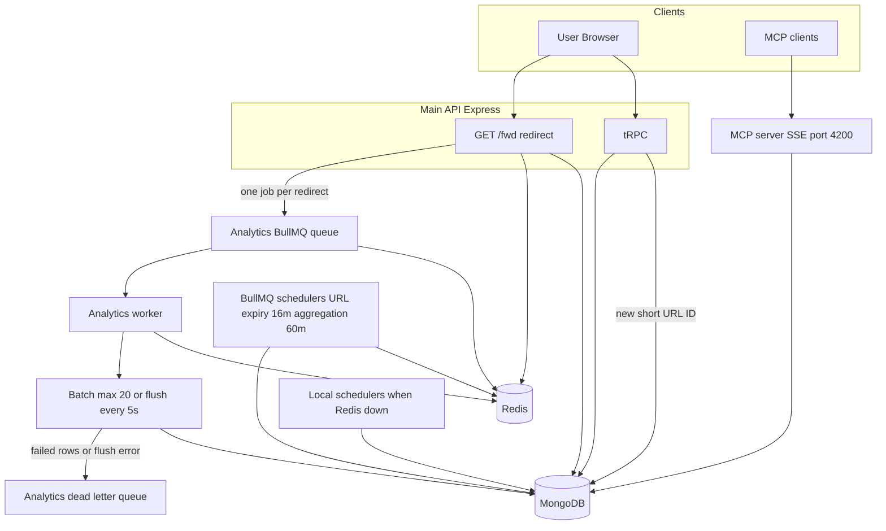
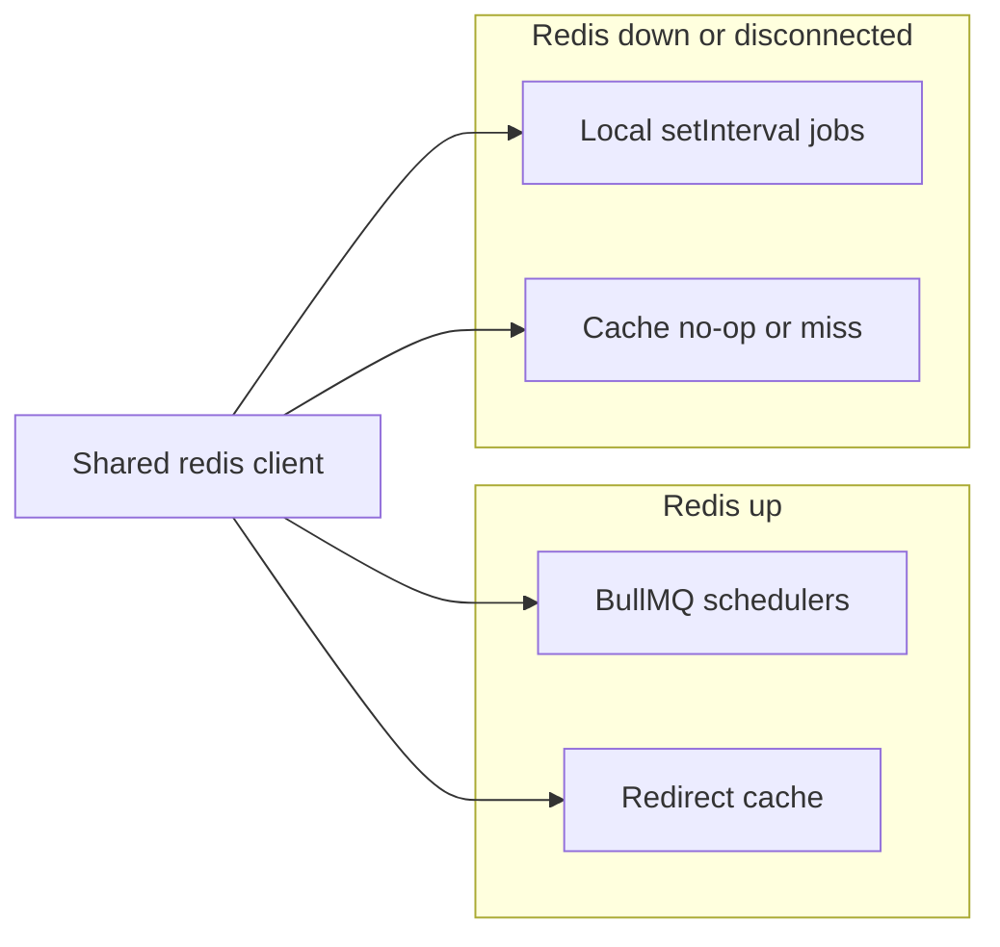

# LinkForge - URL Shortener

> **🚧 Work in Progress** - This project is currently under development and may contain incomplete features or bugs.

A modern, feature-rich URL shortener application with analytics, built with React, TypeScript, Node.js, and MongoDB. Includes Model Context Protocol (MCP) server integration for AI-powered URL management.

---

## 🚀 Features

- **URL Shortening**: Create short URLs with custom aliases
- **Analytics**: Comprehensive click tracking and analytics
- **User Authentication**: Secure JWT-based authentication
- **Dashboard**: Beautiful dashboard with charts and insights
- **MCP Integration**: Model Context Protocol server for AI tool integration
- **Responsive Design**: Mobile-first design with dark mode support
- **Docker Support**: Full containerization with Docker Compose
- **Redis-backed background jobs**: BullMQ for URL expiry and analytics aggregation, with **local `setInterval` fallbacks** when Redis is unreachable at startup or after the shared Redis client disconnects; work moves back to BullMQ when Redis is ready again
- **Degraded cache when Redis is down**: Redirect lookup cache skips Redis when unavailable. The **short-URL counter** now uses MongoDB, so short URL creation works as long as MongoDB is available.
- **Observability Stack**: Prometheus metrics collection, Grafana dashboards, and comprehensive monitoring with Redis/MongoDB exporters
- **API Key Caching**: Redis-based caching for API key verification to improve authentication performance
- **Enhanced Metrics**: Custom metrics for HTTP requests, queue performance, Redis operations, and URL operations

---

## 🏗️ Architecture

### Tech Stack

| Component            | Technology                                                                |
| -------------------- | ------------------------------------------------------------------------- |
| **Frontend**         | React 18, TypeScript, Vite, Tailwind CSS, ShadCN UI                       |
| **Backend**          | Node.js, Express, TypeScript                                              |
| **Database**         | MongoDB, Redis                                                            |
| **Authentication**   | JWT (access + refresh tokens) + API Key caching                           |
| **Analytics**        | Custom analytics service with Redis caching and BullMQ-backed aggregation |
| **Monitoring**       | Prometheus, Grafana, Redis/MongoDB exporters                              |
| **MCP Server**       | Model Context Protocol for AI integration                                 |
| **Containerization** | Docker & Docker Compose                                                   |

### Project Structure

```
url-shortener/
├── client/                 # React frontend application
│   ├── src/
│   │   ├── components/     # Reusable UI components
│   │   ├── services/       # API services and MCP client
│   │   ├── pages/          # Page components
│   │   ├── store/          # State management
│   │   └── hooks/          # Custom React hooks
│   └── Dockerfile
├── server/                 # Node.js backend API
│   ├── src/
│   │   ├── controllers/    # Route controllers
│   │   ├── routes/         # API routes
│   │   ├── config/         # Configuration files
│   │   ├── utils/          # Utility functions
│   │   ├── queues/         # Queue systems
│   │   ├── workers/        # Background job workers
│   │   ├── producers/      # Queue producers
│   │   ├── models/         # Data models
│   │   ├── services/       # Business logic
│   │   ├── repositories/   # Data access layer
│   │   ├── middlewares/    # Express middlewares
│   │   ├── server.ts       # Main server entry point
│   │   └── mcp.server.ts   # MCP server implementation
│   └── Dockerfile
├── compose.yaml            # Docker Compose configuration
└── README.md              # This file
```

### System runtime flow

**Clients:** The React app calls the API over HTTP (**`/trpc`**). Public short links use **`GET /fwd/:shortUrl`** on the main Express app. **MCP** is a separate process (default **`MCP_SERVER_PORT` 4200**, SSE) when enabled in bootstrap—see [`server/src/mcp.server.ts`](server/src/mcp.server.ts).

**Create short URL (tRPC):** Allocating a new link now uses a **MongoDB-based counter** (`getNextId`). **Redis is no longer required for short URL creation**. Reads, redirects, and counter allocation all use MongoDB.

**Redirect and click analytics (Redis up):** Each successful redirect builds a payload and **`addAnalyticsJob`** pushes a job onto the **analytics BullMQ** queue (backed by Redis). The **analytics worker** buffers jobs in memory and **bulk-inserts** when either:

- the batch reaches **20** jobs, or
- a **5 second** timer fires (periodic flush—so you also flush on a time window, not only when size hits 20).

Inserts go to MongoDB. **Dead-letter queue:** rows that fail during the bulk insert, or the whole batch if the flush throws, are **added to the analytics dead-letter queue** for inspection/replay later.

**Redirect when Redis is down:** The user is still redirected using MongoDB (and degraded cache behavior). **BullMQ does not run without Redis**, so **click analytics are not recorded through the queue** in that state—**improvements here are in progress.**

**Scheduled jobs:** With Redis up, **URL expiry** runs on BullMQ on a **~16 minute** cadence and **analytics aggregation** on a **~60 minute** cadence. If Redis is unavailable, **local `setInterval` schedulers** approximate the same work (no BullMQ).

**Viewing diagrams:** Built-in Markdown preview (**Ctrl+Shift+V**) in VS Code and Cursor does **not** render Mermaid. Options: install [Markdown Preview Mermaid Support](https://marketplace.visualstudio.com/items?itemName=bierner.markdown-mermaid) and open the preview from that extension, or view this file on GitHub (Mermaid is supported there). The text diagram below works in any preview.

**Text diagram (works everywhere):**

```
                        +------------------+
                        |   User Browser   |
                        +--------+---------+
                                 |
           +---------------------+----------------------+
           |                     |                      |
           v                     v                      v
    +-------------+      +---------------+       +---------------+
    | React Client|      | GET /fwd/...  |       | MCP clients   |
    |  /trpc      |      | (redirect)    |       | SSE :4200     |
    +------+------+      +-------+-------+       +-------+-------+
           |                      |                      |
           v                      v                      v
    Express + tRPC          same Express app           MCP server
           \                      |                     /
            +----------+----------+--------------------+
                                  |
    +------------------------------------------------------------------+
    |                                                                  |
   |  CREATE SHORT URL (uses MongoDB counter)                         |
    |  Redis UP  --> counter OK --> persist URL in MongoDB             |
   |  MongoDB DOWN -> creation fails (no new short URL)               |
    |                                                                  |
    |  REDIRECT                                                         |
    |  --> resolve target from MongoDB (Redis cache if available)       |
    |  Redis UP  --> enqueue 1 analytics job per redirect --> BullMQ   |
    |  Redis DOWN -> redirect OK, queue offline (analytics gap/WIP)    |
    |                                                                  |
    v                                                                  v
  MongoDB                                                           Redis
 (URLs, analytics                                                  (counter,
  aggregates)                                                       BullMQ)

    Analytics worker (Redis UP only):
      redirect jobs -> in-memory batch -> flush if |batch|>=20 OR every 5s
                    -> bulk insert MongoDB
                    -> failures -> Dead letter queue

    Schedulers:
      Redis UP   -> BullMQ: URL expiry ~16 min, aggregation ~60 min
      Redis DOWN -> Local timers: same two jobs without BullMQ
```

<details>
<summary>Mermaid version (GitHub / Mermaid-enabled preview)</summary>



</details>

### Redis and background jobs

Redis is used for:

- **Redirect cache** (hot path for `/fwd/:shortUrl`)
- **Monotonic short-URL ID** (MongoDB-based counter)
- **BullMQ**: URL expiry scheduler (**~16 minutes** in cron) and analytics aggregation (**~60 minutes** / hourly window in code)
- **Queue monitoring** via Bull Board at `/ui` (development)

**Startup behavior**

- `initRedis()` waits for a successful `PING` or times out after about **3 seconds**, so service bootstrap does not block indefinitely when Redis is slow or down.
- A shared `isRedisAvailable` flag tracks the primary Redis client (`ready`, `error`, `close`, `end`).

**BullMQ vs local schedulers**

- When Redis is available: URL expiry and analytics aggregation run on **BullMQ** (queue + repeatable jobs + worker).
- When Redis is down at boot, or after the shared client sees a disconnect from a BullMQ setup: those workloads fall back to **local timers** (16-minute URL expiry job, 60-minute aggregation interval).

- **New short URLs** now use a MongoDB-based monotonic ID counter: **creation works as long as MongoDB is available**. Redis is not required for this path.

- For **full** behavior—create links, caches, queues, and Bull Board—**keep Redis running**. Docker Compose starts `redis` with a health check so the server waits for a healthy Redis before starting in containers.

**Analytics submission queues**

- Click events are **queued on every redirect** when Redis and BullMQ are healthy; the worker **batches** writes (flush at **20** jobs or **5 s** timer) and sends **failed bulk inserts / flush errors** to the **dead-letter queue** (see [analytics.worker.ts](server/src/workers/analytics.worker.ts)).
- If Redis is down, **the analytics queue does not operate**, so **real-time click analytics are not recorded** through this path; expiry/aggregation can still use **local schedulers**. **Hardening this path is work in progress.**
- Queue clients are created at **module import** time; a down Redis can produce connection noise until it is back.

**Text diagram (Redis modes):**

```
                    Shared Redis client (app singleton)
                                        |
              +-------------------------+-------------------------+
              |                                                   |
      Redis UP (connected)                                 Redis DOWN / close
              |                                                   |
      +-------+-------+                                   +-------+-------+
      |               |                                   |               |
      v               v                                   v               v
 BullMQ +         Redirect                           setInterval      Cache: no-op
 cache hit        cache OK                           local jobs      or cache miss
 (expiry,         (hot path)                         (expiry,          (degraded)
  aggregation)                                        aggregation)
```

<details>
<summary>Mermaid version (GitHub / Mermaid-enabled preview)</summary>



</details>

---

## Environment variables reference

Configuration is validated at startup by [`server/src/config/env.ts`](server/src/config/env.ts). Copy [`server/.env.example`](server/.env.example) to `server/.env` and adjust. **Required** (no default): `DB_URL`, `REDIS_URL`, `BASE_URL`, `JWT_ACCESS_SECRET` (min 10 chars), `JWT_REFRESH_SECRET` (min 10 chars). All other keys have defaults if omitted.

| Variable                          | Default                           | Description                                                                       |
| --------------------------------- | --------------------------------- | --------------------------------------------------------------------------------- |
| `PORT`                            | `4000`                            | HTTP API port                                                                     |
| `MCP_SERVER_PORT`                 | `4200`                            | MCP server port                                                                   |
| `NODE_ENV`                        | `development`                     | `development` \| `production` \| `test`                                           |
| `APP_NAME`                        | `LinkForge`                       | Application display name                                                          |
| `APP_VERSION`                     | `1.0.0`                           | Application version string                                                        |
| `DB_URL`                          | —                                 | MongoDB connection string (required)                                              |
| `REDIS_URL`                       | —                                 | Redis connection string (required)                                                |
| `BASE_URL`                        | —                                 | Public base URL of the API (required)                                             |
| `REDIS_COUNTER_KEY`               | `url_shortener_counter`           | (Legacy) Redis key for monotonic short-URL IDs. Not used; counter now in MongoDB. |
| `JWT_ACCESS_SECRET`               | —                                 | Secret for access tokens; min 10 characters                                       |
| `JWT_REFRESH_SECRET`              | —                                 | Secret for refresh tokens; min 10 characters                                      |
| `ACCESS_TOKEN_EXPIRE`             | `10m`                             | Access token lifetime                                                             |
| `REFRESH_TOKEN_EXPIRE`            | `7d`                              | Refresh token lifetime                                                            |
| `JWT_EXPIRES_IN`                  | `7d`                              | JWT expiry (general default where used)                                           |
| `URL_EXPIRY_SCHEDULER`            | `url_expiry_scheduler`            | BullMQ queue name for URL expiry                                                  |
| `AGGREGATION_ANALYTICS_SCHEDULER` | `aggregation_analytics_scheduler` | BullMQ queue name for hourly aggregation                                          |
| `ANALYTICS_DEAD_LETTER_QUEUE`     | `analytics_dead_letter_queue`     | Dead-letter queue name                                                            |
| `ANALYTICS_QUEUE`                 | `analytics-queue`                 | Main analytics submission queue name                                              |
| `URL_QUEUE`                       | `url-queue`                       | URL-related queue name                                                            |
| `EMAIL_TRANSPORTER`               | `smtp`                            | `smtp` \| `gmail` \| `sendgrid`                                                   |
| `SMTP_HOST`                       | `localhost`                       | SMTP host                                                                         |
| `SMTP_PORT`                       | `587`                             | SMTP port                                                                         |
| `SMTP_SECURE`                     | `false`                           | Use TLS                                                                           |
| `SMTP_USER`                       | `""`                              | SMTP username                                                                     |
| `SMTP_PASS`                       | `""`                              | SMTP password                                                                     |
| `EMAIL_FROM_ADDRESS`              | `noreply@linkforge.com`           | From address for transactional email                                              |
| `EMAIL_FROM_NAME`                 | `LinkForge`                       | From name                                                                         |
| `EMAIL_TEMPLATES_PATH`            | `./src/utils/email-templates`     | Path to email templates                                                           |
| `VERIFICATION_TOKEN_EXPIRE`       | `24h`                             | Email verification token TTL                                                      |
| `RESET_TOKEN_EXPIRE`              | `30m`                             | Password reset token TTL                                                          |
| `EMAIL_REQUEST_RATE_LIMIT`        | `3`                               | Rate limit for email-related requests                                             |
| `CLIENT_URL`                      | `http://localhost:3000`           | Frontend URL (CORS, links in emails)                                              |
| `SERVER_TIMEOUT`                  | `30000`                           | Server timeout (ms)                                                               |
| `KEEP_ALIVE_TIMEOUT`              | `65000`                           | HTTP keep-alive timeout (ms)                                                      |
| `HEADERS_TIMEOUT`                 | `66000`                           | Headers timeout (ms)                                                              |
| `MAX_CONNECTIONS`                 | `1000`                            | Max connections hint                                                              |
| `HEALTH_CHECK_TIMEOUT`            | `5000`                            | Health check timeout (ms)                                                         |
| `CORS_ORIGINS`                    | `http://localhost:5173,...`       | Comma-separated allowed origins                                                   |

**Docker vs local URLs**: On the Docker internal network use `DB_URL=mongodb://mongo:27017/url_shortener` and `REDIS_URL=redis://redis:6379`. On your host with `npm run dev`, use `localhost` for both (see `.env.example`).

---

## 🐳 Docker Setup

### Prerequisites

- Docker and Docker Compose installed on your system
- Git for cloning the repository

### Quick Start

1. **Clone the repository**

   ```bash
   git clone https://github.com/Abhi-wolf/LinkForge.git
   cd LinkForge
   ```

2. **Start the application** (Compose file is [`compose.yaml`](compose.yaml))

   ```bash
   docker compose -f compose.yaml up -d
   ```

   Docker Compose V1 users can run `docker-compose -f compose.yaml up -d` instead.

3. **Access the applications**
   - **Frontend**: http://localhost:3000
   - **Backend API**: http://localhost:4000
   - **MCP Server**: http://localhost:4200
   - **Bull Board (queue UI)**: http://localhost:4000/ui
   - **Prometheus**: http://localhost:9090
   - **Grafana**: http://localhost:3001 (admin/admin)
   - **Redis Exporter**: http://localhost:9121/metrics
   - **MongoDB Exporter**: http://localhost:9216/metrics

### Services

The Docker Compose setup includes:

- **mongo** (port 27017): Primary database for URL data
- **redis** (port 6379): Cache, ID counter, and BullMQ job backend
- **Server** (ports 4000, 4200): Backend API and MCP server
- **Client** (port 3000): React frontend application
- **Prometheus** (port 9090): Metrics collection and monitoring
- **Grafana** (port 3001): Visualization dashboards
- **Redis Exporter** (port 9121): Redis metrics for Prometheus
- **MongoDB Exporter** (port 9216): MongoDB metrics for Prometheus

### Environment variables (Docker)

For the **full variable list and defaults**, see [Environment variables reference](#environment-variables-reference) above.

When running **inside** [`compose.yaml`](compose.yaml), set at least `DB_URL` and `REDIS_URL` using Compose service hostnames (`mongo`, `redis`). The bundled `server.environment` block may be minimal; extend it or mount a `.env` file so required secrets (`JWT_ACCESS_SECRET`, `JWT_REFRESH_SECRET`, etc.) and optional keys match production needs. Align names with [`server/src/config/env.ts`](server/src/config/env.ts) (for example use `JWT_ACCESS_SECRET`, not `JWT_SECRET`).

⚠️ **Security**: Use strong JWT secrets in production; never commit real `.env` files.

---

## 🔧 MCP Server Integration

### Overview

The Model Context Protocol (MCP) server allows AI assistants to interact with the URL shortener through a standardized interface.

### MCP Server Details

- **URL**: http://localhost:4200
- **Transport**: Server-Sent Events (SSE)
- **Authentication**: API Key middleware

### Available Tools

The MCP server exposes the following tools:

1. **create_short_url**
   - Creates a short URL from an original URL
   - Input: `{ originalUrl: string, tags?: [string],expirationDate?: Date }`

2. **get_original_url**
   - Retrieves the original URL from a short URL ID
   - Input: `{ shortUrl: string }`

3. **get_analytics_info_about_a_url**
   - Retrieves analytics for a specific URL
   - Input: `{ shortUrl: string, startDate: Date, endDate: Date }`

4. **get_all_user_urls**
   - Retrieves all URLs created by the authenticated user
   - Input: No parameters required

### Connecting to MCP Server

#### API Key Authentication

The MCP server requires an API key for authentication. To generate an API key:

1. **Generate API Key** (via your application settings or API)
2. **Use the API Key** in the `x-api-key` header for all MCP requests

#### Using MCP Inspector

1. Install the MCP inspector:

   ```bash
   npx @modelcontextprotocol/inspector
   ```

2. Open your browser and navigate to:

   ```
   http://localhost:6274/?MCP_PROXY_AUTH_TOKEN=
   ```

3. The inspector UI will allow you to test all available tools.

---

## 📱 Application Features

### Frontend Features

- **Landing Page**: Public URL shortening without authentication
- **User Authentication**: Login and registration with JWT tokens
- **Dashboard**: Overview with KPI cards and charts
- **Link Management**: Create, view, edit, and delete short URLs
- **Analytics**: Detailed click analytics with charts
- **Settings**: Profile management and password change
- **Dark Mode**: System, light, and dark theme support

### Backend Features

- **RESTful API**: Full CRUD operations for URLs
- **Authentication**: JWT-based auth with refresh tokens
- **Analytics**: Click tracking with device and referrer data
- **Caching and counter**: Redis-backed redirect cache with graceful degradation when Redis is unavailable; **MongoDB-based monotonic ID counter** for short URL creation
- **Background jobs**: BullMQ for URL expiry and analytics aggregation, with local schedulers when Redis is unavailable (see [Redis and background jobs](#redis-and-background-jobs))
- **Rate Limiting**: API rate limiting and security
- **Health Checks**: Docker health checks for all services
- **Metrics Collection**: Comprehensive Prometheus metrics for HTTP, queue, Redis, and URL operations
- **API Key Management**: Secure API key generation and caching for MCP authentication

---

### API Endpoints

#### Health Check

- `GET /health-check` - Service health status

#### Metrics Endpoints

- `GET /metrics` - Prometheus metrics endpoint (HTTP, queue, Redis, URL metrics)

#### Queue monitoring (development)

- `GET /ui` - Bull Board UI for configured BullMQ queues

#### MCP Server

- `GET /sse` - SSE connection endpoint (requires `x-api-key` header)
- `POST /messages` - Message handling endpoint (requires `x-api-key` header)

---

## 🛠️ Development

### Local Development Setup

1. **Install dependencies**

   ```bash
   # Frontend
   cd client
   npm install

   # Backend
   cd server
   npm install
   ```

2. **Set up environment variables**

   ```bash
   # In server directory
   cp .env.example .env
   # Edit .env with your configuration
   ```

3. **Start databases**

   ```bash
   docker compose -f compose.yaml up mongo redis -d
   ```

4. **Run development servers**

   ```bash
   # Backend (in server directory)
   npm run dev

   # Frontend (in client directory)
   npm run dev
   ```

### Building for Production

```bash
# Build frontend
cd client
npm run build

# Build backend
cd server
npm run build
```

---

## 📊 Monitoring & Observability

### Metrics Collection

The application exposes comprehensive Prometheus metrics at `/metrics`:

- **HTTP Metrics**: Request count, duration, errors, rate limiting
- **Queue Metrics**: BullMQ queue sizes, processing times, failure rates
- **Redis Metrics**: Connection status, cache hit/miss ratios, operation counts
- **URL Metrics**: Short URL creation rates, redirect counts, analytics processing

### Monitoring Stack

- **Prometheus** (http://localhost:9090): Collects and stores metrics
- **Grafana** (http://localhost:3001): Visualizes metrics with dashboards
- **Redis Exporter** (http://localhost:9121/metrics): Redis-specific metrics
- **MongoDB Exporter** (http://localhost:9216/metrics): MongoDB-specific metrics

### Health Checks

The Docker Compose setup includes health checks for all services:

- **MongoDB**: Database connectivity check
- **Redis**: Redis ping check
- **Server**: HTTP health check endpoint (`/live`)
- **Exporters**: Metrics endpoint availability

Health status can be checked with:

```bash
docker compose -f compose.yaml ps
```

### API Key Caching

API keys are cached in Redis for improved authentication performance:
- **Cache TTL**: Configurable expiration for API key cache entries
- **Cache Invalidation**: Automatic cache invalidation on key updates/deletions
- **Fallback**: Direct database lookup when cache is unavailable

---

## 🔒 Security Considerations

- JWT secrets should be changed in production
- **API keys should be kept secure and rotated regularly**
- **Never expose API keys in client-side code or public repositories**
- Database credentials should use environment variables
- HTTPS should be enabled in production
- Rate limiting is implemented for API endpoints
- MCP server connections require valid API key via `x-api-key` header

---

## 📝 License

This project is licensed under the MIT License.

---

## 🤝 Contributing

1. Fork the repository
2. Create a feature branch
3. Make your changes
4. Add tests if applicable
5. Submit a pull request

---

**Built with ❤️ using modern web technologies**
